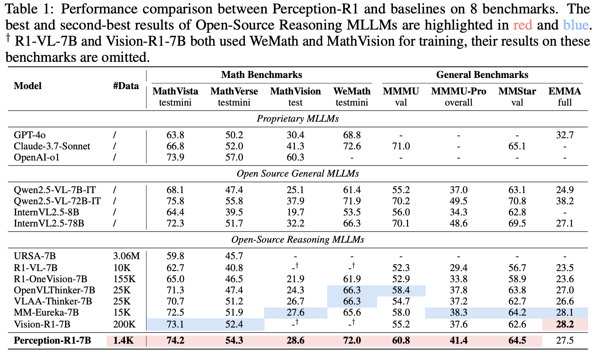

<div align="center">

# Perception-R1: Advancing Multimodal Reasoning Capabilities of MLLMs via Visual Perception Reward

[Tong Xiao](https://github.com/tongxiao2002), [Xin Xu](https://github.com/XinXU-USTC), Zhenya Huang, Hongyu Gao, Quan Liu, Enhong Chen*

*Corresponding Author

📃[Paper](https://arxiv.org/abs/2506.07218) | 🤗[Dataset](https://huggingface.co/datasets/tongxiao2002/Perception-R1-Dataset) | 🤗[Perception-R1-7B checkpoint](https://huggingface.co/tongxiao2002/Perception-R1-7B)

</div>

## Overview

This paper proposes **Perception-R1**, a 7B multimodal large language model (MLLM) with enhanced multimodal perception and reasoning capabilities, trained from [Qwen2.5-VL-7B-Instruct](https://huggingface.co/Qwen/Qwen2.5-VL-7B-Instruct) using GRPO with our proposed novel **Visual Perception Reward**. The motivation for this work stems from the observation that, although Reinforcement Learning with Verifiable Reward (RLVR) can improve the problem-solving accuracy of multimodal tasks, RLVR-trained MLLMs still exhibit significant multimodal perception errors in their responses (as shown in the figure above), which hinders the development of genuine multimodal reasoning capabilities.

### RLVR Fails to Improve Multimodal Perception in MLLMs
To further validate this phenomenon, we conduct McNemar's test on 50 randomly selected problems (named $\mathcal{D}$) from the geometry subset of MathVista. The experimental results point out:
- For Qwen2-VL-7B-Instruct, the numbers of discordant cases related to multimodal perception are 1 and 5, yielding p-values of 0.22.
- For Qwen2.5-VL-7B-Instruct, the numbers are 2 and 4, yielding p-values of 0.69.

Both of them are far from the 0.05 significance level, indicating that the multimodal perception capabilites of RLVR-trained MLLMs are not significantly different from their original conterparts.

### Visual Perception Reward

To address the above issue, we innovatively introduce the **Visual Perception Reward**, which explicitly encourage MLLMs to generate content that reflects accurate multimodal understanding.

As shown in the figure, we first collect accurate CoT trajectories for the RL training data, which can be sourced from open-source SFT datasets or distilled from stronger MLLMs (we distill [Gemini-2.5-Pro](https://deepmind.google/models/gemini/pro/)). Next, we employ a text LLM to extract visual annotations from the collected CoT trajectories, treating them as the visual ground truth during RL training. Since these visual annotations are textual and difficult to evaluate using rule-based systems, we additionally introduce a LLM ("judging LLM" in the figure) to assess the consistency between the visual annotations and the responses generated by the policy model, and finally assign visual perception reward based on these judgments.

### Experiment Results
Our training data is derived from the Geometry3K dataset. After performing CoT trajectory distillation and accuracy-based filtering, we retain only **1,442** high-quality multimodal samples for RL training. The experimental results are as follows:



**Perception-R1** demonstrates strong multimodal reasoning capabilities across several challenging and widely-used multimodal math benchmarks, outperforming baselines trained on **10–100×** more data. This highlights the effectiveness of our proposed framework. Furthermore, we conduct McNemar’s test on Perception-R1 using $\mathcal{D}$ and observe 2 and 10 discordant cases for multimodal perception, yielding a $p$-value of 0.04. This is below the 0.05 significance threshold, indicating that Perception-R1 achieves a statistically significant improvement in multimodal perception over the original MLLM.

## Getting Started
### Environment Preparation
You can install the python dependencies by executing following commands:
```shell
conda create -n perception-r1 python=3.10 -y

conda activate perception-r1
pip3 install -r requirements.txt
```

### Data Preparation
You can also download the dataset from [Google Drive](https://drive.google.com/file/d/1Y7x2xWy1QnSqM1SwUHyTyL4f9gFLRQW9/view?usp=sharing), and then put it under the `data` directory.

### Training
The entire training process can be completed in approximately 16 hours using 16 NVIDIA A800-80G GPUs, with 8 GPUs allocated for vLLM serving and the remaining 8 for RL training.

You should first start a vllm server:
```shell
bash examples/vllm_qwen_serve.sh
```
Then modify the `VLLM_SERVER_BASE_URL`, `VLLM_SERVER_API_KEY` and `VLLM_MODEL_NAME` fields in `examples/run_qwen2_5_vl_7b_geo3k_visual_swanlab.sh` based on your config.

Once the vllm server is initialized, you can run following scripts to start training:
```shell
bash examples/run_qwen2_5_vl_7b_geo3k_visual_swanlab.sh
```

## Major Modifications
Our modifications for incorporating the visual perception reward are primarily implemented in the following modules:
- `verl/workers/reward/custom.py`: Contains the core logic for assigning rewards to model-generated responses, including the implementation of the N-gram penalty reward.
- `verl/utils/reward_score/math_with_visual.py`: Implements the visual perception reward, which evaluates the consistency between visual annotations and generated responses.
- `verl/utils/reward_score/boxed_math_verify.py`: Implements the accuracy and format rewards used during the training process to ensure correctness and structured output format.

## Citation
If you find our work helps, please consider citing:
```plain
@article{xiao2025advancing,
  title={Advancing Multimodal Reasoning Capabilities of Multimodal Large Language Models via Visual Perception Reward},
  author={Tong Xiao and Xin Xu and Zhenya Huang and Hongyu Gao and Quan Liu and Qi Liu and Enhong Chen},
  journal={arXiv preprint arXiv:2506.07218},
  year={2025},
}
```
